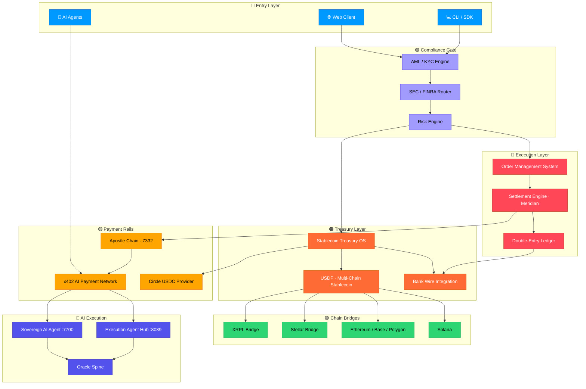
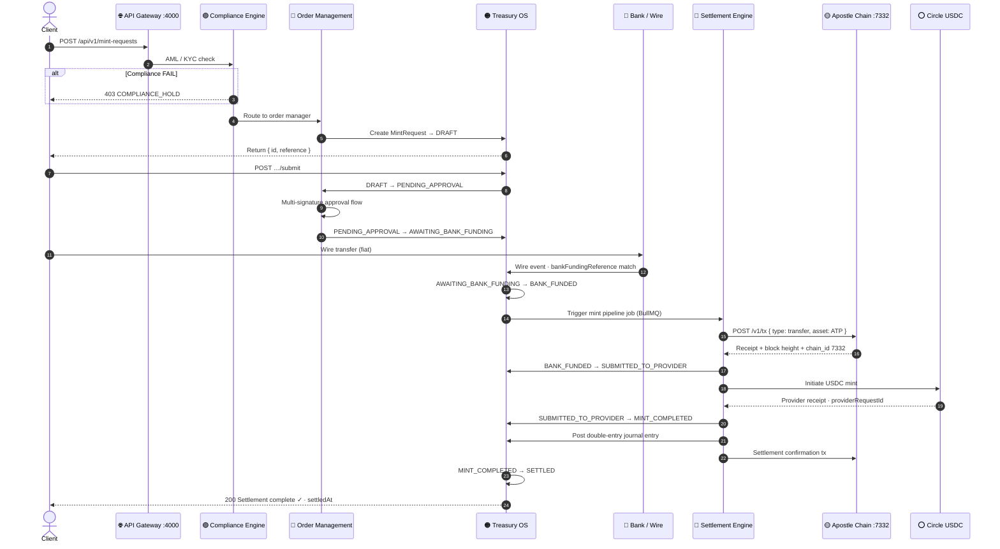
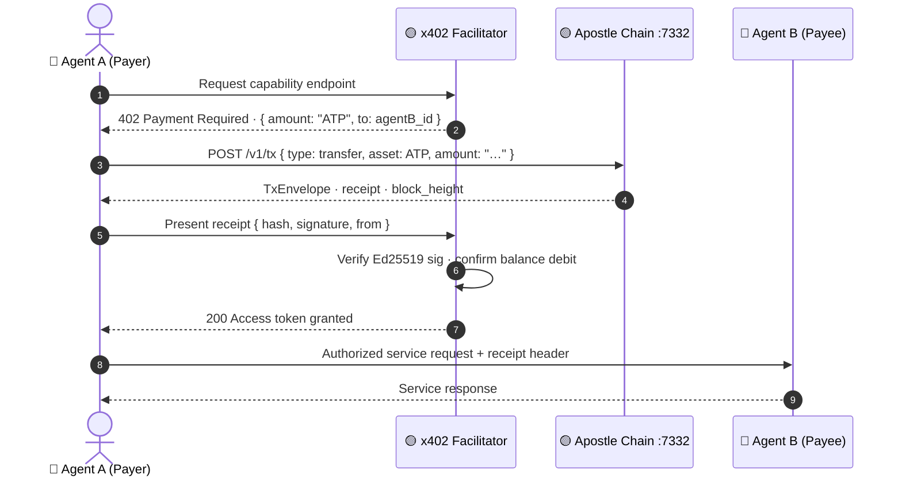
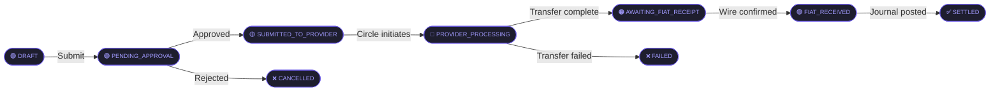

<div align="center">


# M1

### Master Execution & Settlement Platform

[](/)
[](/)
[](/)
[](/)
[](/)
[](/)

**Sovereign financial execution layer** — multi-chain settlement, AI-agent payment rails,
institutional treasury management, and regulatory-compliant order execution.

---

[Architecture](#️-architecture) · [Execution Flow](#-execution-flow) · [Components](#-components) · [API Surface](#-api-surface) · [Deployment](#-deployment)

</div>

---

## 🗺️ Color-Coded Table of Contents

<table>
<tr>
<th width="50%">Domain</th>
<th width="50%">Domain</th>
</tr>
<tr>
<td>

**🔴 Core Systems**
- [Settlement Engine](#-settlement-engine)
- [Order Management System](#-order-management-system)
- [Execution Router](#️-architecture)

**🟠 Financial Layer**
- [Stablecoin Treasury OS](#-stablecoin-treasury-os)
- [USDF Stablecoin](#-usdf-stablecoin)
- [Bank Integration](#-bank-integration)

**🟡 Payment Infrastructure**
- [Apostle Chain · 7332](#-apostle-chain)
- [x402 AI Payment Network](#-x402-payment-network)
- [Multi-Chain Bridges](#-multi-chain-bridges)

**🟢 Live Assets**
- [KENNY / EVL Tokens](#-kenny--evl-tokens)
- [RWA Tokenization Platform](#-rwa-platform)
- [Solana Token Launcher](#-solana-launcher)

</td>
<td>

**🔵 AI Execution**
- [Sovereign AI Agent](#-sovereign-ai-agent)
- [Execution Agent](#-execution-agent)
- [Oracle Spine Tool Registry](#-oracle-spine)

**🟣 Compliance & Risk**
- [SEC / FINRA Compliance](#-sec--finra-compliance)
- [AML / KYC Engine](#-aml--kyc-engine)
- [Audit & Reporting](#-audit--reporting)

**⚫ Infrastructure**
- [System Architecture](#️-architecture)
- [Execution Flow](#-execution-flow)
- [API Surface](#-api-surface)
- [Deployment](#-deployment)
- [Monitoring](#-monitoring)
- [Security](#-security)

</td>
</tr>
</table>

---

## 🏗️ Architecture

> **M1** is the sovereign money layer that interconnects FTH Trading's entire financial ecosystem — from institutional order routing and regulatory compliance, to AI-to-AI micro-payments, all anchored by the Apostle Chain settlement ledger.



---

## ⚡ Execution Flow

### Primary Settlement Path — Mint (Fiat → Stablecoin)



---

### AI-to-AI Payment Flow — x402 Protocol



---

### Redemption Path — Stablecoin → Fiat



---

## 📦 Components

### 🔴 Settlement Engine

| Property | Value |
|:---------|:------|
| **Engine** | Meridian (Rust) |
| **Settlement Time** | < 3 s average |
| **Supported Assets** | USDC · USDT · ATP · UNY · XRP · XLM |
| **Chains** | XRPL · Stellar · Ethereum · Polygon · Base · Solana · Tron |
| **Accounting** | Full GAAP double-entry journal ledger |
| **Idempotency** | Provider-key deduplication on all operations |
| **Queue** | BullMQ · `mint-workflow` · `redemption-workflow` |

### 🟠 Stablecoin Treasury OS

| Property | Value |
|:---------|:------|
| **API** | Fastify 4 · port 4000 · prefix `/api/v1` |
| **Database** | PostgreSQL 16 · Prisma 5 |
| **Queue** | BullMQ on Redis |
| **Auth** | JWT · multi-signature approval flows |
| **Compliance** | Per-entity policy engine |
| **Reconciliation** | Real-time break detection + auto-reporting |
| **MintRequest States** | `DRAFT → PENDING_APPROVAL → AWAITING_BANK_FUNDING → BANK_FUNDED → SUBMITTED_TO_PROVIDER → MINT_COMPLETED → SETTLED` |
| **RedemptionRequest States** | `DRAFT → PENDING_APPROVAL → SUBMITTED_TO_PROVIDER → PROVIDER_PROCESSING → FIAT_RECEIVED → SETTLED` |

### 🟡 Apostle Chain

| Property | Value |
|:---------|:------|
| **Chain ID** | 7332 |
| **Runtime** | Rust · Axum |
| **Port** | 7332 |
| **Block Time** | 50 ms tick (transaction-driven) |
| **Assets** | ATP (APO, 18 dec) · UNY · USDF · XRP · XLM |
| **Registered Agents** | 35 mesh agents |
| **Signing** | Ed25519 · SovereignKeyring |
| **Settlement Bridges** | XRPL + Stellar |
| **TxEnvelope** | `{ hash, from: UUID, nonce, chain_id: 7332, payload, signature, timestamp }` |

### 🟡 x402 Payment Network

| Property | Value |
|:---------|:------|
| **Protocol** | HTTP 402 AI-to-AI pay rails |
| **Runtime** | Cloudflare Workers |
| **Settlement** | ATP on Apostle Chain |
| **Pricing** | Metered per-request + PASS tier subscriptions |
| **Registered Agents** | 35+ |
| **Billing** | OpenMeter · usage metering |

### 🔵 Sovereign AI Agent

| Property | Value |
|:---------|:------|
| **Runtime** | Python · GPU-accelerated |
| **Inference** | Local GPU inference with cloud fallback |
| **Embeddings** | High-dimensional vector search |
| **Voice** | Text-to-speech · Speech-to-text |
| **Biometrics** | Face + voice authentication |
| **Port** | 7700 |
| **Tools** | Oracle Spine — 7 subsystem registries |

### 🔵 Execution Agent

| Property | Value |
|:---------|:------|
| **Architecture** | Tiered inference routing with speech capability |
| **Core Port** | 8089 |
| **Executors** | Marketing (8101) · Coding (8103) · DevOps (8104) |
| **LLM Latency** | ~1.4 s roundtrip |
| **Embeddings** | GPU-accelerated · sub-300 ms warm |

### 🟢 Live On-Chain Assets

| Asset | Chain | Status |
|:------|:------|:-------|
| **KENNY Token** | Polygon Mainnet | 🟢 LIVE |
| **EVL Token** | Polygon Mainnet | 🟢 LIVE |
| **USDF Stablecoin** | XRPL · Stellar · ETH · Polygon · Solana | 🟢 LIVE |
| **Child First Platform** | Polygon Mainnet | 🟢 LIVE |
| **RWA Platform** | Multi-chain | 🟢 LIVE |
| **Solana Token Launcher** | Solana Mainnet | 🟢 LIVE |

### 🟣 Compliance Layer

| Property | Value |
|:---------|:------|
| **Standards** | SEC · FINRA · AML · KYC |
| **Uptime** | 99.97% |
| **Check Latency** | < 100 ms |
| **Policy Engine** | Per-entity evaluation with override controls |
| **Audit Trail** | Immutable event store · SIEM-ready |
| **Automated Filing** | Regulatory report generation |

---

## 🌐 API Surface

```
BASE: /api/v1

🔑 Authentication
  POST  /auth/login               →  JWT access + refresh tokens
  POST  /auth/refresh             →  Rotate refresh token

🏦 Treasury — Minting
  GET   /mint-requests            →  List (paginated, filterable)
  POST  /mint-requests            →  Create MintRequest [DRAFT]
  GET   /mint-requests/:id        →  Detail + journal entries
  POST  /mint-requests/:id/submit →  Advance to PENDING_APPROVAL
  POST  /mint-requests/:id/fund   →  Record wire (bankFundingReference)
  POST  /mint-requests/:id/cancel →  Cancel with reason

💸 Treasury — Redemptions
  GET   /redemption-requests      →  List (paginated, filterable)
  POST  /redemption-requests      →  Create RedemptionRequest [DRAFT]
  GET   /redemption-requests/:id  →  Detail + provider status
  POST  /redemption-requests/:id/submit

✅ Approvals
  GET   /approvals                →  List pending approvals
  POST  /approvals/:id/decide     →  { decision: APPROVE|REJECT, note }

🏛️ Entities & Accounts
  GET   /entities                 →  List legal entities
  GET   /entities/:id             →  Entity + accounts + wallets
  GET   /treasury-accounts        →  Treasury accounts (entityId filter)
  GET   /wallets                  →  Custodial wallets (asset + network)
  GET   /bank-accounts            →  Banking relationships

📊 Compliance & Reporting
  GET   /compliance/profiles      →  Per-entity compliance profiles
  POST  /compliance/evaluate      →  Policy dry-run check
  GET   /reports/summary          →  Platform-wide metrics dashboard
  GET   /reconciliation/runs      →  Reconciliation run history
  GET   /reconciliation/breaks    →  Open break items

🔍 Apostle Chain (port: 7332)
  GET   /health                   →  Chain liveness
  GET   /status                   →  Height + agent count + block stats
  POST  /v1/tx                    →  Submit TxEnvelope
  POST  /v1/airdrop               →  Mint ATP to agent wallets
  POST  /v1/agents/register       →  Register new mesh agent
  GET   /v1/agent/:id/balance     →  ATP/UNY/USDF balances
  GET   /v1/receipts              →  Transaction receipts

🤖 x402 (Cloudflare Workers)
  GET   /                         →  Facilitator info
  POST  /pay                      →  Process payment receipt
  GET   /agents                   →  Registered agent registry
```

---

## 🚀 Deployment

### Prerequisites

| Tool | Version |
|:-----|:--------|
| Node.js | ≥ 20 |
| pnpm | ≥ 9 |
| PostgreSQL | 16 |
| Redis | ≥ 7 |
| Docker | Optional |

### Quick Start

```bash
# Clone
git clone https://github.com/FTHTrading/M1.git
cd M1

# Install all workspaces
pnpm install

# Configure environment
cp apps/api/.env.example    apps/api/.env
cp apps/web/.env.example    apps/web/.env
cp apps/worker/.env.example apps/worker/.env

# Database
pnpm db:up        # Start PostgreSQL + Redis via Docker Compose
pnpm db:migrate   # Run all Prisma migrations
pnpm db:seed      # Seed initial entities, wallets, treasury accounts

# Development (all services in parallel)
pnpm dev
```

### Service Map

| Service | Stack | Port | Purpose |
|:--------|:------|:-----|:--------|
| `apps/api` | Fastify 4 | 4000 | REST API · auth · business logic |
| `apps/web` | Next.js 15 | 3000 | Operator dashboard (App Router) |
| `apps/worker` | BullMQ | — | Async job processors |
| Apostle Chain | Rust · Axum | 7332 | Settlement ledger |
| Sovereign AI Agent | Python | 7700 | Sovereign AI agent |
| Execution Agent | Python | 8089 | Execution agent hub |
| Inference Runtime | — | 8800 | Primary LLM inference |
| Inference Fallback | — | 11434 | Local LLM fallback |
| Embedding Runtime | — | 8000 | GPU embeddings |

### Monorepo Layout

```
M1/
├── apps/
│   ├── api/          Fastify · authentication · all REST routes
│   ├── web/          Next.js 15 · App Router · TanStack Query
│   └── worker/       BullMQ processors · mint · redemption · wire match
├── packages/
│   ├── database/     Prisma schema · migrations · seed
│   ├── types/        Shared TypeScript contracts
│   ├── providers/    Circle USDC · bank wire adapters
│   ├── ledger/       Double-entry accounting functions
│   ├── compliance/   Policy engine · risk evaluation
│   ├── events/       Immutable event store (Kafka-ready)
│   └── reconciliation/ Break detection · GAAP reporting
└── turbo.json        Turborepo pipeline config
```

---

## 📈 Monitoring

| Metric | SLA Target | Stack |
|:-------|:-----------|:------|
| API Latency (p99) | < 200 ms | Datadog APM |
| Settlement Time | < 3 s | Custom events |
| Apostle Block Time | 50 ms tick | Chain metrics |
| Platform Uptime | 99.97% | Cloudflare |
| Queue Depth | < 100 jobs | BullMQ dashboard |
| Compliance Throughput | > 1,000 checks/s | Prometheus |
| LLM Inference Latency | < 1.5 s | NIM metrics |

---

## 🔐 Security

| Layer | Control |
|:------|:--------|
| **Authentication** | JWT · Ed25519 SovereignKeyring signing |
| **Transport** | TLS 1.3 · certificate pinning |
| **Data at Rest** | AES-256 encryption |
| **API** | Rate limiting · IP allowlisting · CORS |
| **Secrets** | Vault-compatible env isolation |
| **Audit** | Immutable event store · SIEM-ready structured logs |
| **Chain** | Ed25519 signatures on every TxEnvelope · hash verification |
| **Compliance** | Per-entity policy gates before any financial operation |

---

<div align="center">

---

**FTH Trading © 2026 — All rights reserved**

[](https://github.com/FTHTrading)
[](/)
[](/)
[](/)

*Built with precision · Secured by design · Powered by AI*

</div>
